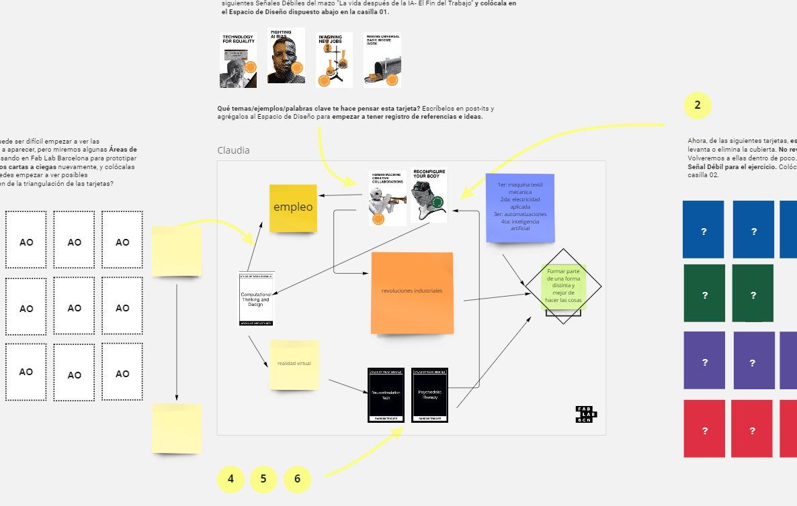

## Atlas of Weak Signals

<iframe width="960" height="450" src="https://www.youtube.com/embed/L7yyGwTrT5g" title="YouTube video player" frameborder="0" allow="accelerometer; autoplay; clipboard-write; encrypted-media; gyroscope; picture-in-picture" allowfullscreen></iframe>

## Presentación

<iframe src="https://docs.google.com/presentation/d/e/2PACX-1vRbXBoZVTThiXDqx18sCW9sX8gyKd7rudLpw0l5OaFNGfvjSOwEMwciVP7SEke1xe_er3Z0mx6t8yPl/embed?start=false&loop=false&delayms=3000" frameborder="0" width="960" height="450" allowfullscreen="true" mozallowfullscreen="true" webkitallowfullscreen="true"></iframe>

## Miro Board

- [Demo](https://miro.com/app/board/uXjVPSBTP3Q=/?share_link_id=375137572814)

- [Ejercicio en grupo](https://miro.com/app/board/uXjVPSAhpV4=/?share_link_id=128496480692)
