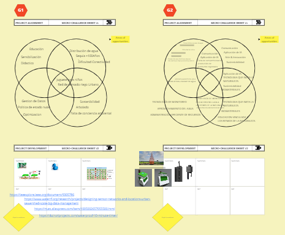
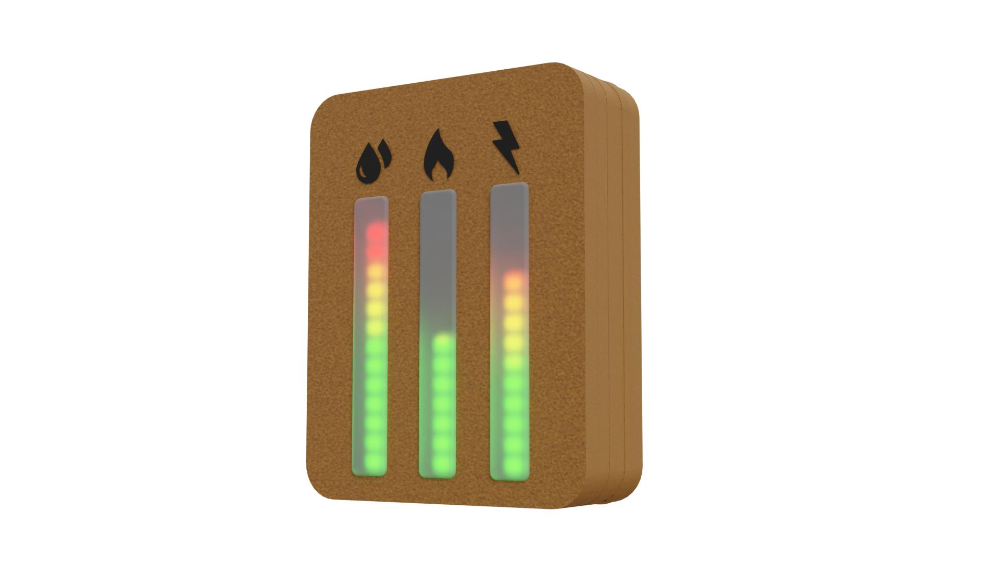

## Presentación Challenge

<iframe src="https://docs.google.com/presentation/d/e/2PACX-1vRG1FnVz8EPJQHaJE5WEwbyEMovTpFFPnllDVxPh6BVM1bl9IqxdkGUNLFF-5oAXpLjvVVrGZRy40cJ/embed?start=false&loop=false&delayms=3000" frameborder="0" width="960" height="450" allowfullscreen="true" mozallowfullscreen="true" webkitallowfullscreen="true"></iframe>

## Miro

- [Board](https://miro.com/app/board/uXjVPSmyYSg=/)

## Proyectos

### Equipo 1 - Pato al agua

- [Repositorio](https://github.com/Ldelavega1980/mirepositorio/tree/main/Challenge)

### Equipo 2 - SENSOR HOGAR

- [Repositorio](https://github.com/cecifalivene/documentacionFB/blob/main/SENSORHOGAR.md)
